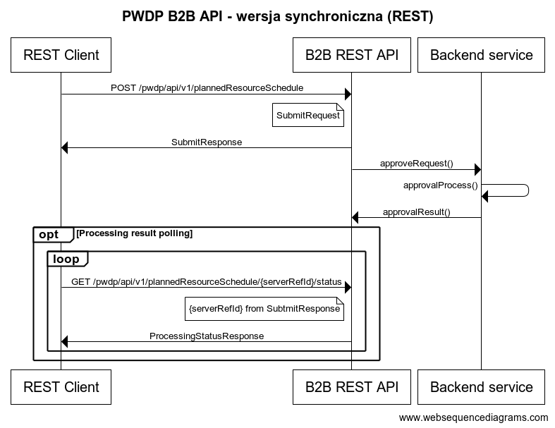
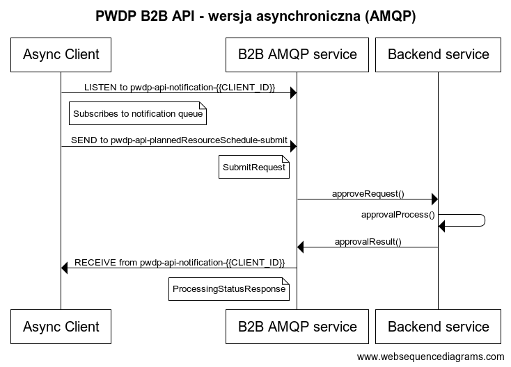

# PWDP B2B API client documentation

## Ogólne informacje

Serwis PWDP B2B API wystawaia publiczne API umożliwiające przesyłanie grafików planowanej generacji oraz odebranie informacji zwrotnej (statusu, ewentualnych błędów itp). 
API udostępnione jest w 2 wersjach: synchronicznej i asynchronicznej. Model danych używany w obu wersjach jest taki sam i może być reprezentowany zarówno jako JSON jak i XML.

## Specyfikacje OpenAPI i AsyncAPI

Serwis PWDP B2B API udostępnia techniczną specyfikację interfejsów oraz modelu danych w standardzie [OpenAPI](https://www.openapis.org/) (dla synchronicznego REST API) oraz [AsyncAPI](https://www.asyncapi.com/) (dla asynchronicznego API).

Uwaga: wszystkie URL-e do serwisów, nazwy endpointów i kolejek zawarte w specyfikacjach są wstępne i mogą się jeszcze zmienić.

## Autentykacja i autoryzacja

Interfejsy są zabezpieczone za pomocą standardu oAuth2 / OpenID Connect. 
Aplikacja kliencka musi zautentykować się w udostępnionym przez PSE serwisie w celu pozyskania tokena JWT, który następnie używany jest w komunikacji z API.

Przykładowe żądanie HTTP: 

```
POST https://ip.b2b.pse.pl/realms/pwdp-b2b-api/protocol/openid-connect/token
Content-Type: application/x-www-form-urlencoded

grant_type=client_credentials&client_id={clientId}&client_secret={clientSecret}
```

gdzie:
- {clientId} identyfikator klienta
- {clientSecret} hasło klienta

Adres serwisu do autentykacji oraz login i hasło udostępnia PSE.


## API synchroniczne (REST)

API udostępnia 2 endpointy:
- do przesyłania grafików generacji
- do pobrania statusu przetwarzania przesłanego grafiku generacji

Diagram sekwencji:


API umożliwia przesłanie danych w formacie zarówno JSON, jak i XML. 
Wymagane jest wskazanie w nagłówkach HTTP:
- Content-Type - typ zawartości, czy JSON czy XML - odpowiednio application/json lub application/xml.
- Authorization - token JWT pozyskany z serwisu do autentykacji

### Przykładowe żądanie przesłania grafiku generacji:

#### JSON:
```
POST http://localhost:8080/pwdp/api/v1/plannedResourceSchedule
Content-Type: application/json
Authorization: Bearer {tokenJwt}

{
  "clientRefId": "GenerationScheduleMrid-84",
  "type": "A71",
  "schedulePeriod": {
    "start": "2024-10-28T22:00Z",
    "end": "2024-10-29T22:00Z"
  },
  "plannedResources": [
    {
      "mRID": 1,
      "businessType": "A01",
      "measurementUnit": "MAW",
      "registeredResourceMrid": "_b22c1719-5714-4488-8e47-bd9451ceb511",
      "seriesPeriods": [
        {
          "timeInterval": {
            "start": "2024-10-28T22:00Z",
            "end": "2024-10-29T22:00Z"
          },
          "resolution": "PT1H",
          "continuousSeriesPoints": [
            0.000, 0.000, 0.000, 0.000, 0.000, 0.000, 0.000, 0.000,
            0.082, 1.226, 5.046, 7.529, 12.047,11.462,12.350,8.210,
            3.805, 0.693, 0.004, 0.000, 0.000, 0.000, 0.000, 0.000
          ]
        }
      ]
    }
  ]
}
```

Przykładowa odpowiedź:
```
HTTP/1.1 202 Accepted
Content-Type: application/json

{
  "serverRefId": "f6430ca6-f846-415f-9f7d-6d7f24d87089",
  "clientRefId": "GenerationScheduleMrid-84",
  "receivedTime": "2024-11-08T11:03:43.510Z",
  "status": "ACCEPTED",
  "validationViolations": [
    {
      "severity": "WARN",
      "code": "U01",
      "message": "Wartość z grafiku przekracza 100% wartości maksymalnej mocy netto.",
      "details": "Dotyczy serii o mRID 84b95902-23c5-46b0-848c-c6ac0d5a4489 oraz punktu nr 42 w serii."
    }
  ]
}
```

#### XML:
```
POST http://localhost:8080/pwdp/api/v1/plannedResourceSchedule
Accept: application/xml
Content-Type: application/xml
Authorization: Bearer {tokenJwt}

<?xml version="1.0" encoding="UTF-8"?>
<submitRequest clientRefId="GenerationScheduleMrid-84" type="A71">
    <schedulePeriod start="2024-10-28T22:00:00Z" end="2024-10-29T22:00:00.000Z"/>
    <plannedResources>
        <plannedResource mRID="1" businessType="A01" measurementUnit="MAW" registeredResourceMrid="_b22c1719-5714-4488-8e47-bd9451ceb511">
            <seriesPeriods>
                <seriesPeriod resolution="PT1H">
                    <timeInterval start="2024-10-28T22:00:00Z" end="2024-10-29T22:00:00Z"/>
                    <seriesPoints>
                        <seriesPoint position="42" quantity="42.128"/>
                    </seriesPoints>
                    <continuousSeriesPoints>
                        0.000 0.000 0.000 0.000 0.000 0.000 0.000 0.000
                        0.082 1.226 5.046 7.529 12.047 11.462 12.350 8.210
                        3.805 0.693 0.004 0.000 0.000 0.000 0.000 0.000
                    </continuousSeriesPoints>
                </seriesPeriod>
            </seriesPeriods>
        </plannedResource>
    </plannedResources>
</submitRequest>
```

Przykładowa odpowiedź:
```
HTTP/1.1 202 Accepted
Content-Type: application/xml

<?xml version="1.0" encoding="UTF-8" standalone="yes"?>
<submitResponse serverRefId="0ddb81c4-6e13-42e8-a2cf-805603d91753" clientRefId="GenerationScheduleMrid-84"
                receivedTime="2024-11-08T11:11:40.6445706Z" status="ACCEPTED">
    <validationViolations>
        <validationViolation severity="WARN" code="U01"
                             message="Wartość z grafiku przekracza 100% wartości maksymalnej mocy netto."
                             details="Dotyczy serii o mRID 84b95902-23c5-46b0-848c-c6ac0d5a4489 oraz punktu nr 42 w serii."/>
    </validationViolations>
</submitResponse>
```

Atrybut serverRefId przekazany w odpowiedzi jest unikalnym identyfikatorem, którym nalezy posługiwać się w dalszej komunikacji.

### Przykładowe żądanie pobrania statusu przetwarzania przesłanego grafiku generacji:

#### JSON
```
GET http://localhost:8080/pwdp/api/v1/plannedResourceSchedule/f6430ca6-f846-415f-9f7d-6d7f24d87089/status
Authorization: Bearer {tokenJwt}
```

Przykładowa odpowiedź:
```
HTTP/1.1 200 OK
Content-Type: application/json

{
  "serverRefId": "f6430ca6-f846-415f-9f7d-6d7f24d87089",
  "clientRefId": "GenerationScheduleMrid-84",
  "status": "ACCEPTED",
  "validationViolations": [
    {
      "severity": "WARN",
      "code": "U01",
      "message": "Wartość z grafiku przekracza 100% wartości maksymalnej mocy netto.",
      "details": "Dotyczy serii o mRID 84b95902-23c5-46b0-848c-c6ac0d5a4489 oraz punktu nr 42 w serii."
    }
  ]
}
```

#### XML
```
GET http://localhost:8080/pwdp/api/v1/plannedResourceSchedule/0ddb81c4-6e13-42e8-a2cf-805603d91753/status
Accept: application/xml
Authorization: Bearer {tokenJwt}
```

Przykładowa odpowiedź:
```
HTTP/1.1 200 OK
Content-Type: application/xml

<?xml version="1.0" encoding="UTF-8" standalone="yes"?>
<processingStatusResponse serverRefId="0ddb81c4-6e13-42e8-a2cf-805603d91753" clientRefId="GenerationScheduleMrid-84"
                          status="ACCEPTED">
    <validationViolations>
        <validationViolation severity="WARN" code="U01"
                             message="Wartość z grafiku przekracza 100% wartości maksymalnej mocy netto."
                             details="Dotyczy serii o mRID 84b95902-23c5-46b0-848c-c6ac0d5a4489 oraz punktu nr 42 w serii."/>
    </validationViolations>
</processingStatusResponse>
```

## API asynchroniczne (AMQP)

API udostępnia 2 kolejki:
- do przesyłania grafików generacji
- do pobrania statusu przetwarzania przesłanego grafiku generacji (kolejka dedykowana per OSD)

Klient powinien zasubskrybować się jako słuchacz do kolejki, gdzie dostanie powiadomienia o statusie przetwarzania przesłanego przez siebie grafiku.
Druga kolejka służy do przesłania grafiku generacji, który zostanie przekazany do przetwarzania przez systemy PSE.

Diagram sekwencji:


API umożliwia przesłanie danych w formacie zarówno JSON, jak i XML.
Gdy klient chce posługiwać się formatem XML, należy wskazać to w nagłówku wiadomości:
- Content-Type: application/xml.

Autentykacja i autoryzacja połączenia z systemem kolejkowym odbywa się podobnie jak w przypadku REST API, z wykorzystaniem oAuth2 / OpenID Connect.


